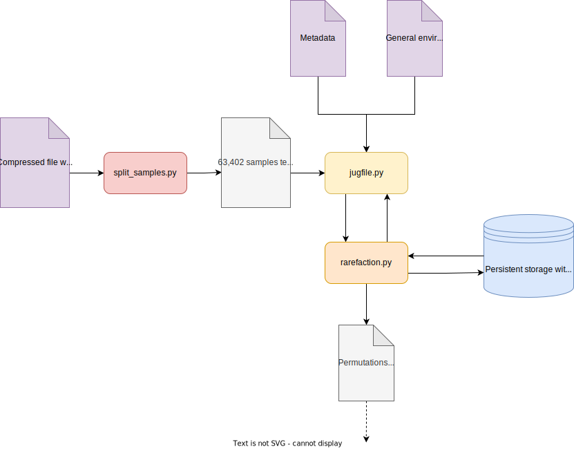
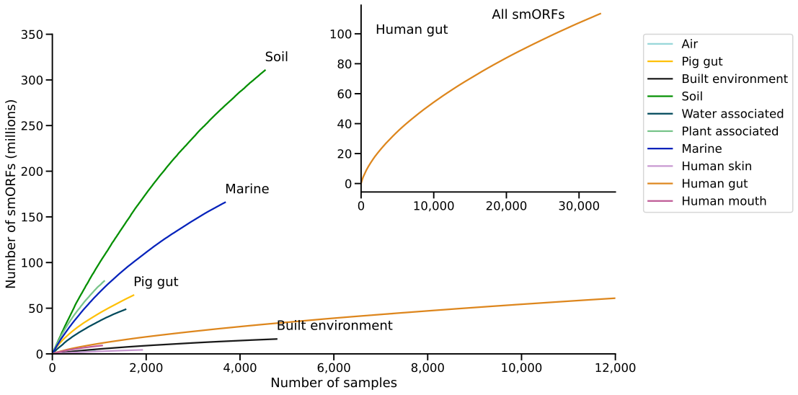
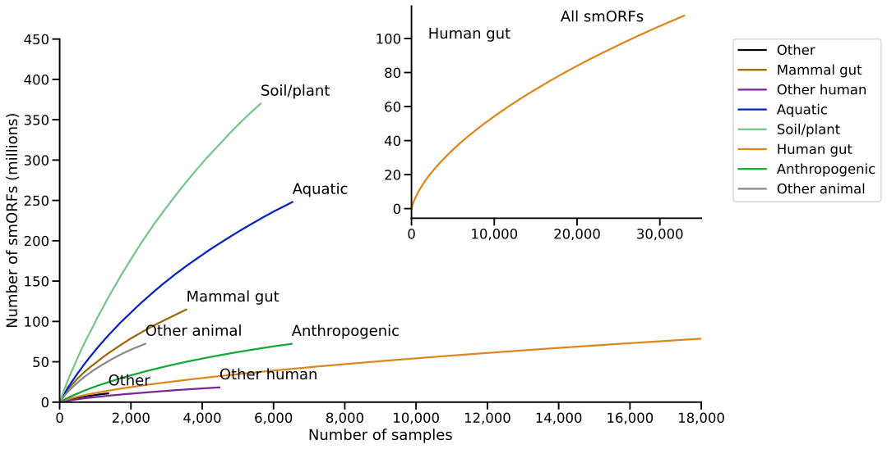

# Global Microbial Small ORFs Catalog - Gene rarefaction for smORFs

<!-- "general environment name" is internal baseball (Célio made up that term), a general reader will not understand it -->
**Abstract**: Having a dataset with around 1 billion unique smORFs, we generated rarefaction curves for different habitats, considering their general environment names, and also grouping them in higher-level environment names.
The curves show that habitats such as soil remain relatively under-sampled and show higher smORFs richness in compared to other environments.

## Distribution of the Small Open Reading Frames

There are millions of open reading frames (ORFs) spread through the genomes from diverse habitats that, if they were translated, would generate many small proteins (those with fewer than 100 amino acids).
<!-- LPC: "we have" — who is 'we' and what does 'have' mean in this context? -->
In this context, we have the small ORFs (smORFs), which have the vast majority of functions still unknown, although previous studies collected and annotated a considerable number of smORFs [1, 2].

<!-- LPC: I am not sure that the link to function is clear in this project.
I fear that talking about function is a distraction, tbh -->
As for its functions, little is known about the distribution of smORFs across different environments.
For a clearer look at the distribution, we can use methods such as the rarefaction curve, which estimates how the number of observed species increases with the sample size of individuals, assuming that individuals are sampled randomly and independently [3].

Generating rarefaction curves can be a simple problem.
<!-- LPC: I think the following sentence needs to be rewritten -->
Still, in the context of dealing with large-scale biological data, it's expected some adjustments go beyond naive methods to generate these curves.
For this project, we dealt with almost 1 billion unique smORFs spread through the environments, making it unfeasible to just store them in the memory to find the counting of the unique ones.

## Data Processing

Our data consist of a set of samples.
Each sample produces a number of smORFs and is annotated with one or more habitat tags.

We built the following pipeline:

For the table containing the relation of the smORFs to sample, a compressed file, we had 2.9 billion observations.
<!-- LPC: Not sure what the word "discretizing" is indended to mean in the next sentence -->
For this dataset, we had to preprocess it discretizing the smORFs by their IDs, and splitting the dataset into text files by samples, obtaining 63,402 files.
This script was run using PyPy, which uses a just-in-time compiler.

After the splitting, we ran a script to identify the samples of the desired habitats for the rarefaction.
For each chosen habitat, we added its samples in persistent storage using Python's shelve [4], making it computationally feasible to retrieve the smORFs from each sample.

As the rarefaction of different environments can be split into more than one task, we used the Jug framework, which allows us to run the corresponding tasks on different processors [5].
The framework was applied when creating the database for each habitat, and when generating the permutations of the samplings.

One of the issues to consider when dealing with a large number of elements in Python is how to represent them.
In Python 3 we can have integers with at least 24 bytes.
To have in the memory 100 million smORFs, we would need to have at least 24 GB of memory.
Considering that, to represent the smORFs we used the bitarray library, which provides an object type that efficiently represents an array of booleans.

For each permutation we had a bitarray object, and, as we add more samples with their corresponding smORFs, we indicate in it the smORFs already found with 1.
And for each number of samples considered, we summed all "True" values to find the unique counting of smORFs. We generated 24 permutations.

## Rarefaction Curves

With the permutations of the samplings generated, we took the average for each number of samples considered in the permutations.
<!-- LPC I am not sure that Spaghetti plot is the right term (see https://en.wikipedia.org/wiki/Spaghetti_plot) -->
Firstly, we selected the habitats by their general environments names, and only the ten with the most samples to avoid the "Spaghetti plot".
We have the following rarefaction curve:

In this case, habitats such as soil are still under-sampled, but we also have environments such as the human gut and built environment that can be seen as having lower smORFs richness, reaching diminishing returns per sample.

We can also group these habitats by higher-level environment names. Considering this, we have the following rarefaction curve:

Considering the grouping made, we have a similar pattern of the rarefaction curve from before, with soil-related habitat under-sampled and human gut oversampled.

As expected, the rarefaction curves match curves in works such as [6] made for unigenes, showing a similar tendency of over and under-sampling curves with the same habitats.

## Conclusions

<!-- LPC : the following sentence is very unclear -->
In the context of large biological datasets, many tools to study them, such as rarefaction curves, can turn out to be non-trivial to proper application.
Along with running these methods, we need to find suitable ways to represent our data, making the generation of rarefaction curves computationally feasible.
With the optimizations made, we can work with larger datasets with fewer hardware requirements.

We can generate these curves considering multiple habitats, and they can be a great tool to visualize and compare the richness of an element such as smORFs in them.

---

[1] Ji, X., Cui, C., & Cui, Q. (2020). smORFunction: a tool for predicting functions of small open reading frames and microproteins. BMC bioinformatics, 21(1), 1-13.

[2] Aspden, J. L., Eyre-Walker, Y. C., Phillips, R. J., Amin, U., Mumtaz, M. A. S., Brocard, M., & Couso, J. P. (2014). Extensive translation of small open reading frames revealed by Poly-Ribo-Seq. elife, 3, e03528.

[3] Gotelli, N. J., & Colwell, R. K. (2001). Quantifying biodiversity: procedures and pitfalls in the measurement and comparison of species richness. Ecology letters, 4(4), 379-391.

[4] Van Rossum, G. (2020). The Python Library Reference, release 3.8.2. Python Software Foundation.

[5] Coelho, L. P. (2017). Jug: Software for parallel reproducible computation in python. Journal of Open Research Software, 5(1).

[6] Coelho, L. P., Alves, R., Del Río, Á. R., Myers, P. N., Cantalapiedra, C. P., Giner-Lamia, J., ... & Bork, P. (2022). Towards the biogeography of prokaryotic genes. Nature, 601(7892), 252-256.
